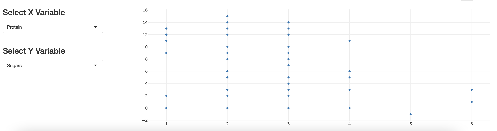

# Homework 2 - Continue to Build on Your Shiny Dashboard

## Overview
We will be building on what we created in workshop 2! 

### Instructions
Make sure you have the latest version of the 02_cereals.R file that I sent out after the session to do your homework! Continue to make changes in that file and complete the following tasks:

1. Make the DataTable update based on what the user selects with the radio buttons. (Hint: Update the `output$table` variable, using the `df_sub()` variable we created at the end of the session)

2. Add a ["Select Box"](https://shiny.posit.co/r/gallery/widgets/widget-gallery/) next to the scatterplot that allows the user to select which column they want to graph for the X variable ("Carbs", "Fiber", "Potassium", "Protein", "Vitamins"). Name the inputId "xaxis"

3. In the same row, add second ["Select Box"](https://shiny.posit.co/r/gallery/widgets/widget-gallery/) next to the scatterplot that allows the user to select which column they want to graph for the Y variable ("Carbs", "Fiber", "Potassium", "Protein", "Vitamins"). Name the inputId "yaxis"

4. Make the scatterplot update based on what the user selects for their X and Y variables. (Hint: Update the the `output$scatter_plot` variable, using the two new input variables you just created in steps 2-3)

    The final layout for the scatterplot section should look like this:
    

5. Redploy your app on to shinyapps.io, and submit the link of your dashboard to the TA!
